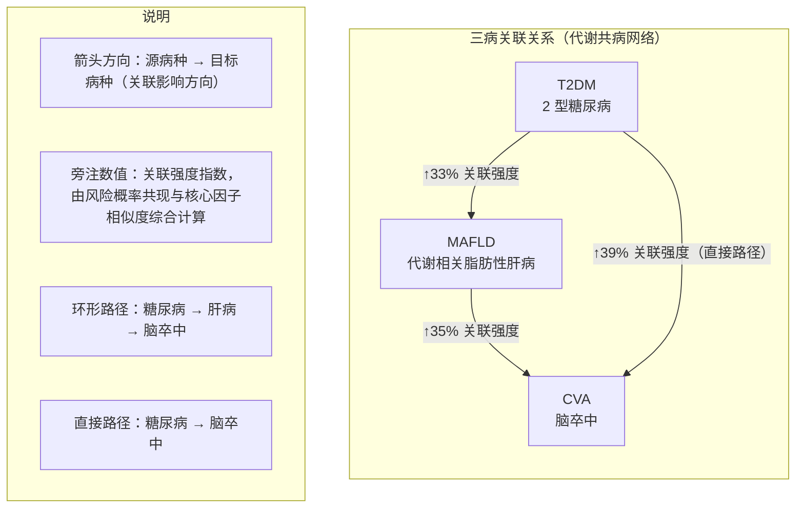

# 三病关联关系图

> 用于作品报告、答辩 PPT 或设计说明。与系统三角图一致：三条**有向关联路径**，弧旁数值为**关联强度指数**（0～98，个体评估时由后端动态计算；示意图可用占位值）。

---

## 一、推荐版图（PlantUML，三角布局）

复制到 [PlantUML 在线编辑器](https://www.plantuml.com/plantuml/uml/) 导出 PNG/SVG。

```plantuml
@startuml 三病关联关系图
skinparam shadowing false
skinparam defaultFontName "Microsoft YaHei"
skinparam roundcorner 20
skinparam nodesep 80
skinparam ranksep 60

skinparam rectangle {
  BackgroundColor #F0FDFA
  BorderColor #0D9488
  FontColor #134E4A
}

' 三病节点（三角布局）
rectangle "MAFLD\n（代谢相关脂肪性肝病）" as Liver #E6FFFA;line:#0D9488
rectangle "T2DM\n（2 型糖尿病）" as DM #E6FFFA;line:#0D9488
rectangle "CVA\n（脑卒中）" as Stroke #E6FFFA;line:#0D9488

Liver -[hidden]right- DM
Liver -[hidden]down- Stroke
DM -[hidden]down- Stroke

' 有向关联边（↑后为关联强度指数，示例值可替换为实际评估结果）
DM -down-> Liver : ↑33%\n糖尿病→肝病
Liver -down-> Stroke : ↑35%\n肝病→脑卒中
DM -down-> Stroke : ↑39%\n糖尿病→脑卒中（直接）

note bottom of Stroke
  **图例**
  · 箭头：有向关联路径（非传染、非严格因果效应量）
  · ↑X%：该路径关联强度指数，越高关联越强
  · 环形：糖→肝→卒；直接：糖→卒
end note

@enduml
```

---

## 二、结构示意（Mermaid）

适合在 VS Code / Cursor 中预览；导出可用 [Mermaid Live](https://mermaid.live)。



---

## 三、Word / draw.io 手绘参考（ASCII）

```
                    ┌─────────────────┐
                    │     T2DM        │
                    │   2 型糖尿病     │
                    └────────┬────────┘
                             │
                    ↑33%（糖尿病→肝病）
                             │
              ┌──────────────┴──────────────┐
              │                             │
              ▼                             ▼
    ┌─────────────────┐           ┌─────────────────┐
    │     MAFLD       │           │  ↑39% 直接路径   │
    │ 代谢相关脂肪性肝病 │──↑35%──▶│     CVA         │
    └─────────────────┘ 肝病→脑卒中  │    脑卒中        │
                                    └─────────────────┘

    环形：T2DM → MAFLD → CVA
    直接：T2DM ──────────▶ CVA
```

---

## 四、三条关联路径说明（可作图注）

| 有向路径 | 临床关联要点（与系统文案一致） |
|----------|-------------------------------|
| **糖尿病 → 肝病** | 长期高血糖与胰岛素抵抗可加重肝脏脂肪沉积，两病常并存并相互促进 |
| **肝病 → 脑卒中** | NAFLD 相关慢性炎症、血脂紊乱与高血压等共同参与动脉粥样硬化，间接影响脑血管事件风险 |
| **糖尿病 → 脑卒中（直接）** | 长期高血糖损伤血管内皮、促进动脉硬化，是缺血性脑卒中的重要可干预危险因素 |

---

## 五、报告用图题与脚注（可直接粘贴）

**图 X 三病关联关系示意图**

> 图中展示肝病（MAFLD）、糖尿病（T2DM）与脑卒中（CVA）之间的三条有向关联路径。箭头表示关联影响方向；旁注「↑X%」为关联强度指数，反映当前评估下该路径关联的相对强弱，用于比较三条路径，不代表患病概率或经因果推断得到的效应量。其中，糖尿病经肝病至脑卒中构成环形关联路径，糖尿病至脑卒中为直接关联路径。

---

## 六、导出步骤

1. **PNG（推荐答辩）**：PlantUML 在线 → 粘贴第一节代码 → Export PNG。  
2. **嵌入 Word**：导出 SVG/PNG 后插入；或用第三节 ASCII 在 draw.io 中重绘为正式配图。  
3. **动态数值**：报告示意图可用固定示例值（如 33/35/39）；若需真实截图，在用户端「风险评估」页截取三角图即可。
