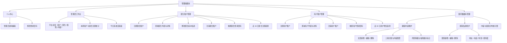
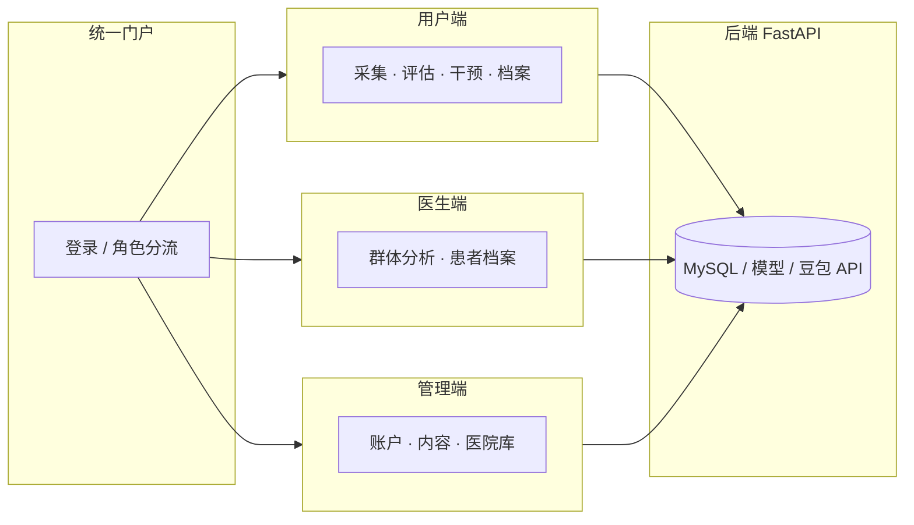

# 三元智鉴 · 三端功能架构图

> 参考医生端模块树状例图整理，**用户端 / 管理端 / 医生端** 各一张，便于论文、答辩或设计说明引用。  
> 依据当前仓库 `web/sanyuan-user`、`web/administrator`、`web/doctor` 实际页面与能力整理（2026-05）。

---

## 一、用户端功能架构图

```mermaid
flowchart TB
  ROOT["用户端模块"]

  ROOT --> ACC["账号与访问"]
  ACC --> ACC1["统一门户登录鉴权"]
  ACC --> ACC2["个人中心（资料 / 改密）"]
  ACC --> ACC3["应用访问门禁（首访仅健康数据）"]

  ROOT --> HOME["用户首页"]
  HOME --> H1["数据采集完成度与快捷入口"]
  HOME --> H2["综合健康评分与人形示意"]
  HOME --> H3["三病风险摘要卡片"]
  HOME --> H4["患病因素玫瑰图"]
  HOME --> H5["疾病关联传播（简版）"]

  ROOT --> DATA["健康数据"]
  DATA --> D1["基础信息问卷（20 项）"]
  DATA --> D2["生活习惯问卷（11 项）"]
  DATA --> D3["生理指标问卷（24 项）"]
  DATA --> D4["化验单图像识别（JPG/PNG 预填）"]
  DATA --> D5["影像上传（肝病超声 / 糖网 / 脑 CT）"]
  DATA --> D6["衍生指标自动计算（BMI / MAP / TyG 等）"]
  DATA --> D7["问卷同步至账户"]
  DATA --> D8["进入风险评估分析"]

  ROOT --> RISK["风险评估"]
  RISK --> R1["综合健康指数与等级"]
  RISK --> R2["三病传播分析（完整版）"]
  RISK --> R3["病种选择与信息完整度"]
  RISK --> R4["核心因素可视化与来源标注"]

  ROOT --> IV["干预方案"]
  IV --> I1["AI 个性化推荐（饮食 / 运动 / 生活）"]
  IV --> I2["健康生活指南（推荐与全文阅读）"]
  IV --> I3["及时就医推荐（定位与距离排序）"]
  IV --> I4["查看本次体检报告"]
  IV --> I5["体检报告下载 PDF"]

  ROOT --> LOG["健康档案"]
  LOG --> L1["评估记录列表与时间筛选"]
  LOG --> L2["综合健康评分趋势"]
  LOG --> L3["三病风险等级热力图"]
  LOG --> L4["多记录对比（评分 / 因素 / 雷达）"]
  LOG --> L5["单条体检报告书查看与下载"]
```



**文字树（与上图等价）**

```
用户端模块
├── 账号与访问
│   ├── 统一门户登录鉴权
│   ├── 个人中心（资料 / 改密）
│   └── 应用访问门禁（首访仅健康数据）
├── 用户首页
│   ├── 数据采集完成度与快捷入口
│   ├── 综合健康评分与人形示意
│   ├── 三病风险摘要卡片
│   ├── 患病因素玫瑰图
│   └── 疾病关联传播（简版）
├── 健康数据
│   ├── 基础信息问卷（20 项）
│   ├── 生活习惯问卷（11 项）
│   ├── 生理指标问卷（24 项）
│   ├── 化验单图像识别（JPG/PNG 预填）
│   ├── 影像上传（肝病超声 / 糖网 / 脑 CT）
│   ├── 衍生指标自动计算
│   ├── 问卷同步至账户
│   └── 进入风险评估分析
├── 风险评估
│   ├── 综合健康指数与等级
│   ├── 三病传播分析（完整版）
│   ├── 病种选择与信息完整度
│   └── 核心因素可视化与来源标注
├── 干预方案
│   ├── AI 个性化推荐
│   ├── 健康生活指南
│   ├── 及时就医推荐（定位排序）
│   ├── 查看本次体检报告
│   └── 体检报告下载 PDF
└── 健康档案
    ├── 评估记录列表与时间筛选
    ├── 综合健康评分趋势
    ├── 三病风险等级热力图
    ├── 多记录对比
    └── 单条体检报告书查看与下载
```

---

## 二、管理端功能架构图



**文字树**

```
管理端模块
├── 个人中心
│   ├── 管理员资料编辑
│   └── 修改登录密码
├── 管理员工作台
│   ├── 平台总览（用户 / 医生 / 医院 / 内容）
│   ├── 本周用户与医生注册统计
│   └── 今日系统活跃度
├── 医生账户管理
│   ├── 注册医生账户
│   ├── 查询医生列表与详情
│   ├── 修改医生基本信息
│   ├── 注销医生账户
│   ├── 重置医生登录密码
│   └── 近 30 日医生注册趋势
├── 用户账户管理
│   ├── 注册用户账户
│   ├── 查询用户列表与详情
│   ├── 注销用户账户
│   ├── 重置用户登录密码
│   └── 近 30 日用户增长趋势
└── 医疗数据库管理
    ├── 健康内容维护
    │   ├── 文章新增 / 编辑 / 删除
    │   ├── 三病分类与内容类型
    │   └── 风险等级与指南展示标记
    ├── 医院信息维护
    │   ├── 医院新增 / 编辑 / 删除
    │   └── 地址 / 电话 / 科室 / 经纬度
    └── 内容与医院分布统计图
```

---

## 三、医生端功能架构图

```mermaid
flowchart TB
  ROOT["医生端模块"]

  ROOT --> ACC["账号与个人"]
  ACC --> ACC1["统一门户登录鉴权"]
  ACC --> ACC2["个人中心（资料 / 改密）"]

  ROOT --> WB["医生工作台"]
  WB --> W1["群体患者总数统计"]
  WB --> W2["高 / 中 / 低风险人数"]
  WB --> W3["风险等级分布图"]
  WB --> W4["三病（MAFLD / T2DM / CVA）占比"]
  WB --> W5["三病共病韦恩分布"]
  WB --> W6["主要患病因素 Top10"]

  ROOT --> ANA["疾病分析"]
  ANA --> A1["三病传播关系分析"]
  ANA --> A2["脂肪肝对糖尿病风险（条件概率）"]
  ANA --> A3["糖尿病对脑卒中风险（分层对比）"]
  ANA --> A4["各病内部风险结构"]
  ANA --> A5["驱动因素贡献雷达（分病种）"]
  ANA --> A6["糖尿病与非糖尿病血糖分布"]

  ROOT --> PAT["患者档案"]
  PAT --> P1["患者选择与基本信息"]
  PAT --> P2["问卷信息完整度"]
  PAT --> P3["综合健康分与 Top10 影响因子"]
  PAT --> P4["分病风险与前五因素"]
  PAT --> P5["历史评估记录列表"]
  PAT --> P6["多快照风险对比分析"]
```



**文字树**

```
医生端模块
├── 账号与个人
│   ├── 统一门户登录鉴权
│   └── 个人中心（资料 / 改密）
├── 医生工作台
│   ├── 群体患者总数统计
│   ├── 高 / 中 / 低风险人数
│   ├── 风险等级分布图
│   ├── 三病占比
│   ├── 三病共病韦恩分布
│   └── 主要患病因素 Top10
├── 疾病分析
│   ├── 三病传播关系分析
│   ├── 脂肪肝对糖尿病风险（条件概率）
│   ├── 糖尿病对脑卒中风险（分层对比）
│   ├── 各病内部风险结构
│   ├── 驱动因素贡献雷达（分病种）
│   └── 糖尿病与非糖尿病血糖分布
└── 患者档案
    ├── 患者选择与基本信息
    ├── 问卷信息完整度
    ├── 综合健康分与 Top10 影响因子
    ├── 分病风险与前五因素
    ├── 历史评估记录列表
    └── 多快照风险对比分析
```

---

## 四、三端关系示意（可选）



---

## 使用说明

1. 在 VS Code / Cursor 中打开本文件，安装 **Mermaid** 预览插件即可渲染三张架构图。  
2. 导出为 PNG/SVG：可用 [Mermaid Live Editor](https://mermaid.live) 粘贴对应代码块导出。  
3. 若需与例图完全一致的**方框连线手绘风格**，可将各节「文字树」复制到 draw.io / ProcessOn 的「组织结构图」模板中快速排版。
